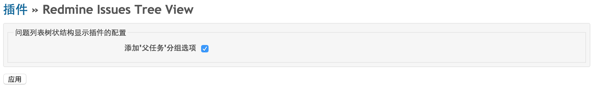
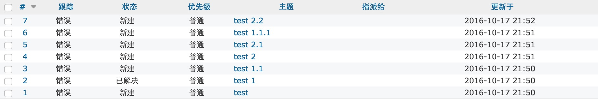
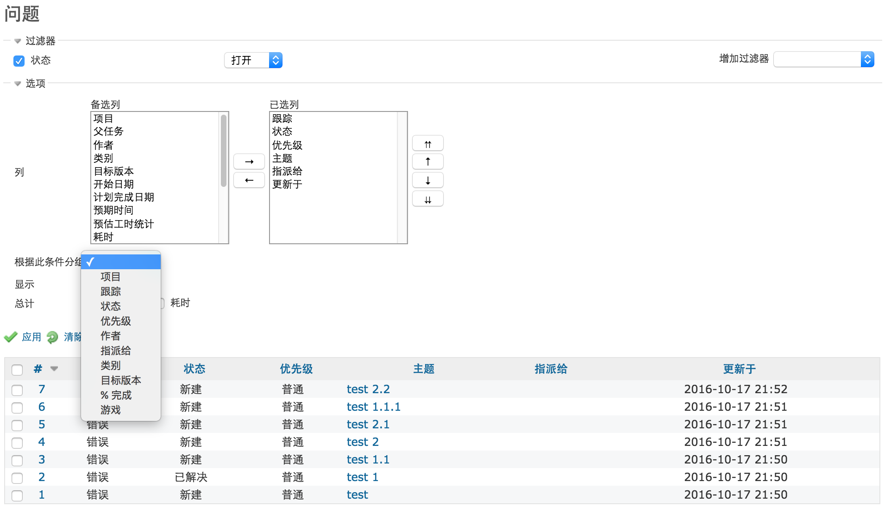
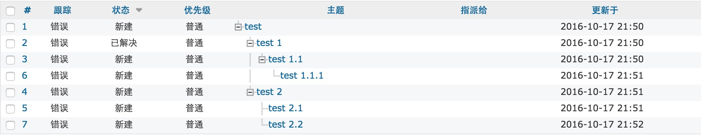
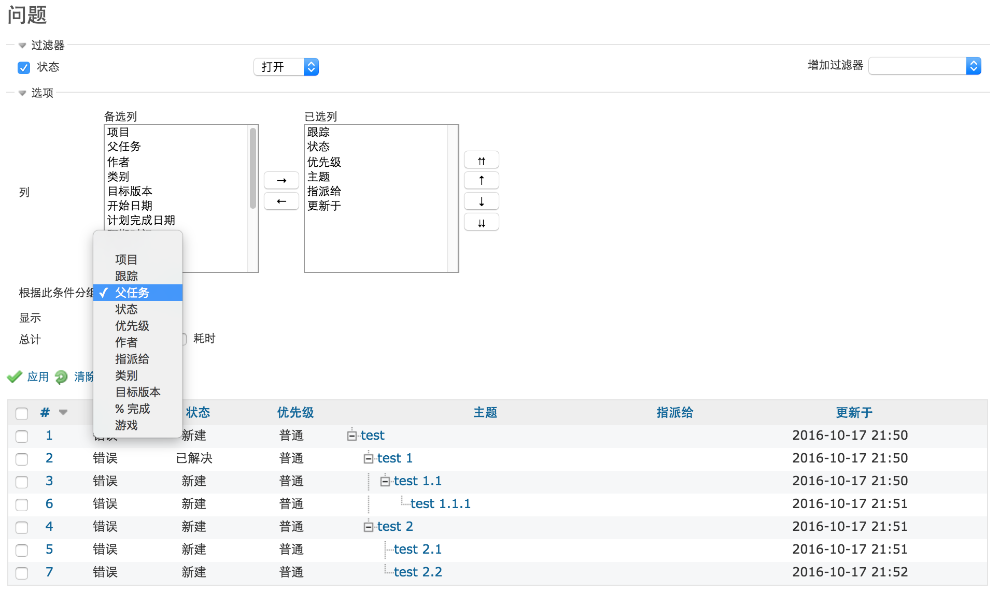

# Redmine issues tree view
This is a Redmine plugin which can turn issues default index view into a tree view.

## Author
Charlene Chen

Contact: charlene.chen168@gmail.com

## Installation
- Download the plugin

- Install the plugin as described at: www.redmine.org/wiki/redmine/Plugins (this plugin does not require a plugin database migration)

- Restart Redmine

## Uninstalling

- Remove the directory “redmine_issues__tree_view” from the plugin-directory “./plugins”

- Restart Redmine

## Usage
Just install the plugin.
After restarting, issues in the index view are grouped by parent issue by default and the view is modified and rendered using the views provided by the plugin.

### Plugin setting page

Note: after installing this plugin, checkbox in the plugin setting page is checked by default. You can uncheck it without uninstall the plugin to removed the side effect of this plugin.

## Example of interface
**Here is a default issues list:**

**And here is the default group_by select options:**

**Here is same issues list, but in the tree view:**

And here is the same group_by select options, but adding 'parent(父任务)' option:

